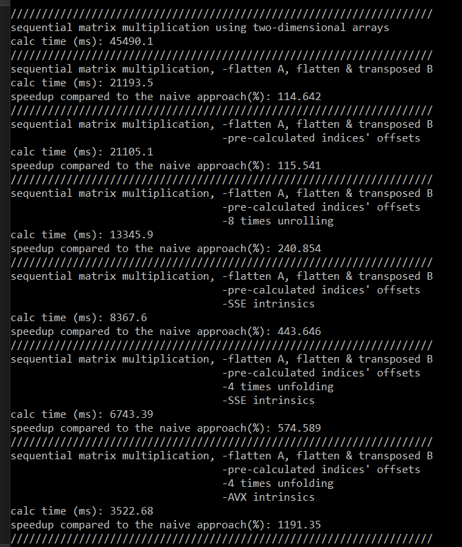

# Parallel-Matrix-Multiplication

Parallel matrix multiplication using OpenMP/vectorization.

This code is developed in C++ and takes advantage of several code optimization concepts to speed up matrix multiplication. 
These optimizations include: 
1. Storing matrices in 1-dimensional format and transposing the second matrix to reduce cache misses.
2. Unfolding loops to reduce loop execution overtime.
3. Using SSE/AVX vectorization intrinsics to utilize the maximum computational capacity of each core.
4. OpenMP parallelization to take advantage of all logical cores of a multi-processor.

There are different versions of the matrix multiplication function in the code, each uses one or more of the mentioned optimization concepts above. The following pictures show the speedup over the naive implementation each improved function achieves on core-i7 CPU with 12 logical cores. Matrices are of the size (4000\*2048) and (2048\*1200).

